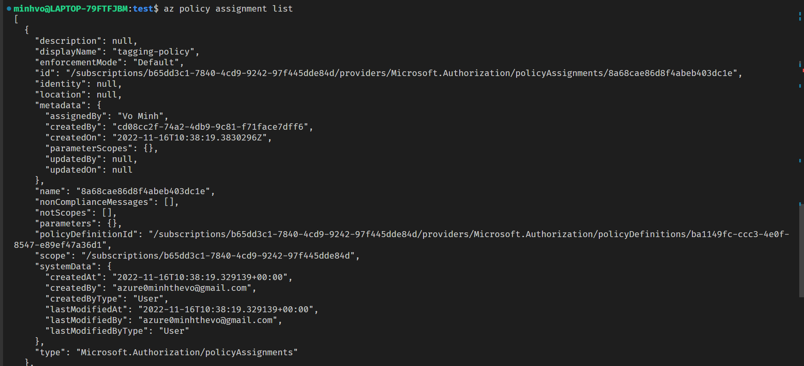
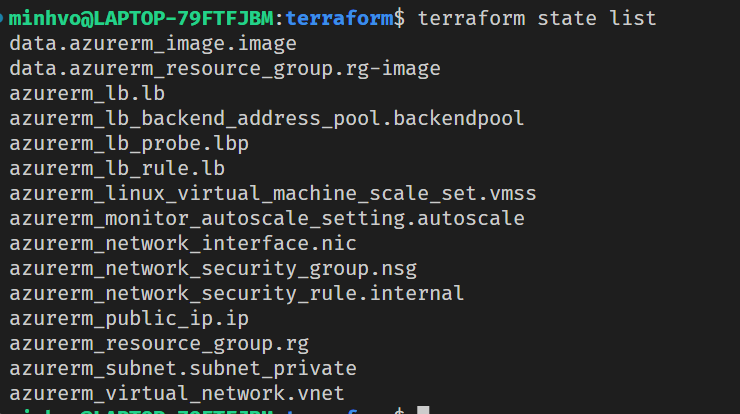
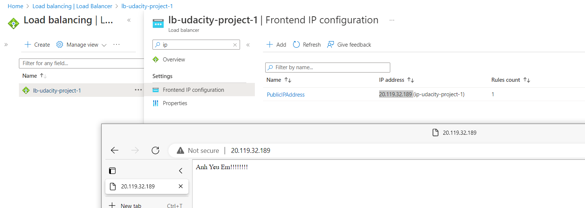

# Udacity Azure Devops Project 1
- This repo using terraform to deploy web application on Azure Cloud.
- Author: minhthevo123@gmail.com 
## How to apply this terraform configuration
### Environment required
- [Terraform](https://developer.hashicorp.com/terraform/tutorials/aws-get-started/install-cli) installed
- [Azure CLI](https://learn.microsoft.com/en-us/cli/azure/install-azure-cli) installed
- [Packer](https://developer.hashicorp.com/packer/tutorials/docker-get-started/get-started-install-cli) installed
- Create Azure account/subscription. Be sure you have the contributor permission on that subscription
- Clone this repository
### Apply the configuration
```BASH
    az group create -n rg-udacity-images
```
- Build web server image using Packer and upload image to Azure
```BASH
    cd packer
    packer build ./server.json
```
- Terraform part
```BASH
    cd terraform

    ### Initialize terraform project
    terraform init

    ### (Optional) See the terraform plan
    terraform plan

    ### Apply terraform configuration
    terraform apply

    ### Changing the minimum of web server instance 
    ### Or you can manually update the input in terraform/variables.tf file
    terraform apply -var min_vm_capacity=<MinSize(>=1)>
```

### Screenshots
1. Policy assignment


2. Terraform state list after apply


3. Web application
- Note: This load balancer may be deleted when ou review due to cost reduction
